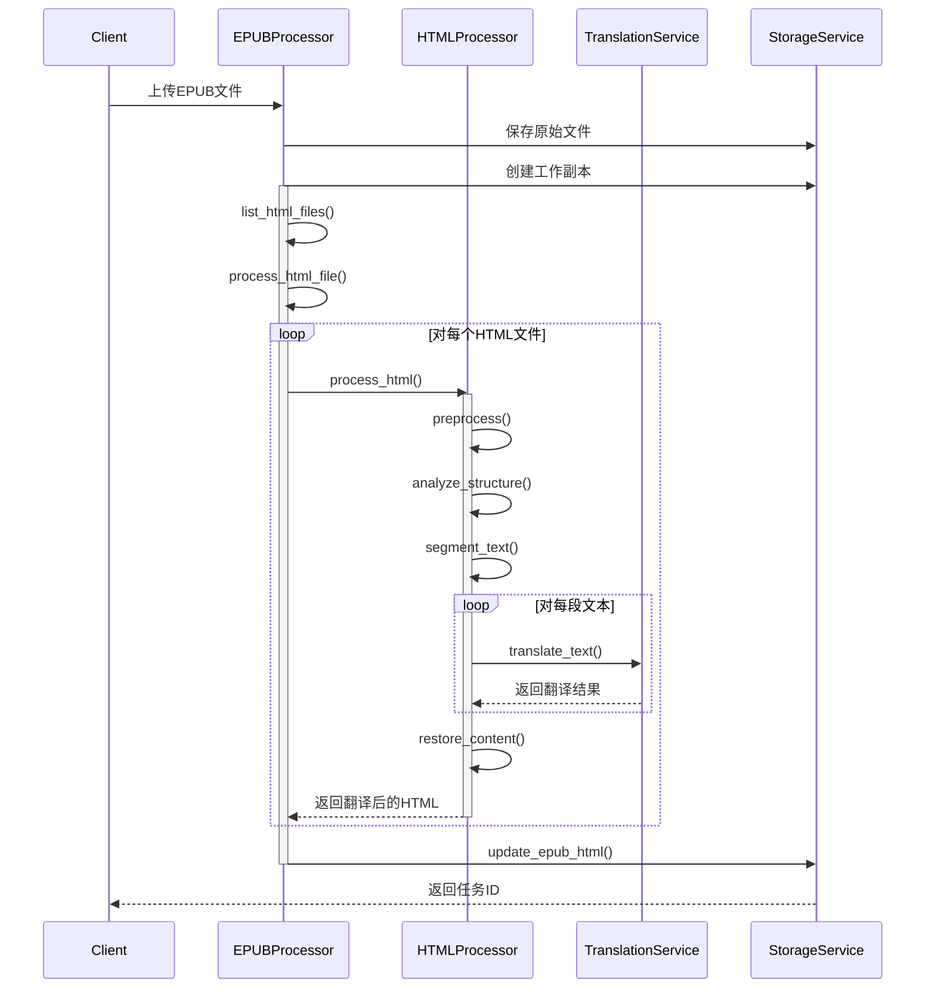

# EPUBox 最小可用版本架构设计

## 1. 系统概述

EPUBox 是一个基于网络服务的EPUB电子书翻译系统。最小可用版本专注于核心功能：在保持原书结构的同时翻译EPUB内容。

## 2. 系统架构

### 2.1 整体架构

```
┌─────────────────────────────────┐
│          Web API层             │
├─────────────────────────────────┤
│          核心服务层            │
│  ┌──────────┐    ┌──────────┐  │
│  │  EPUB    │    │  翻译    │  │
│  │  处理器  │    │  服务    │  │
│  └──────────┘    └──────────┘  │
├─────────────────────────────────┤
│          基础设施层            │
│  ┌──────────┐    ┌──────────┐  │
│  │  存储    │    │  日志    │  │
│  │  服务    │    │  服务    │  │
│  └──────────┘    └──────────┘  │
└─────────────────────────────────┘
```

### 2.2 核心组件

1. **Web API层**
   - 电子书上传和翻译接口
   - 翻译结果下载接口
   - 用户认证接口

2. **核心服务层**
   - EPUB处理器：处理EPUB文件的解析和重构
   - 翻译服务：对接翻译API（如OpenAI）
   - 认证服务：管理用户认证和授权

3. **基础设施层**
   - 存储服务：管理上传文件和翻译结果
   - 日志服务：基本系统日志

## 3. 基本工作流

```
┌──────────┐     ┌──────────┐     ┌──────────┐
│  上传    │ ──> │  翻译    │ ──> │  下载    │
└──────────┘     └──────────┘     └──────────┘
```

1. 用户上传EPUB文件
2. 系统处理翻译
3. 用户下载结果

## 4. 核心组件设计

### 4.1 处理流程



### 4.2 EPUB处理器

```python
class EPUBProcessor:
    """EPUB文件处理核心组件"""
    
    def __init__(self, html_processor: HTMLProcessor, storage: StorageService):
        self.html_processor = html_processor
        self.storage = storage
    
    async def process_epub(self, file_id: str, source_lang: str, target_lang: str) -> str:
        """
        处理EPUB文件的主入口
        - 协调整个翻译流程
        - 返回翻译后的文件ID
        """
        try:
            # 创建工作副本
            work_copy_id = await self.storage.create_work_copy(file_id)
            
            # 获取EPUB中的HTML文件列表
            html_files = await self.list_html_files(work_copy_id)
            
            # 处理每个HTML文件
            tasks = []
            for html_file in html_files:
                task = self.process_html_file(
                    work_copy_id,
                    html_file,
                    source_lang,
                    target_lang
                )
                tasks.append(task)
            
            # 并行处理HTML文件
            await asyncio.gather(*tasks)
            
            return work_copy_id
            
        except Exception as e:
            # 出错时删除工作副本
            await self.storage.delete_file(work_copy_id)
            raise e
    
    async def process_html_file(self, epub_id: str, html_path: str, source_lang: str, target_lang: str):
        """
        处理单个HTML文件
        - 从EPUB中读取HTML
        - 调用HTML处理器
        - 更新EPUB中的HTML
        """
        # 从EPUB中读取HTML内容
        html_content = await self.storage.read_epub_html(epub_id, html_path)
        
        # 翻译HTML内容
        translated_html = await self.html_processor.process_html(
            html_content,
            source_lang,
            target_lang
        )
        
        # 更新EPUB中的HTML文件
        await self.storage.update_epub_html(epub_id, html_path, translated_html)
    
    async def list_html_files(self, epub_id: str) -> list:
        """
        获取EPUB中的HTML文件列表
        - 解析EPUB结构
        - 返回所有HTML文件的路径
        """
        pass
```

### 4.3 存储服务

```python
class StorageService:
    """存储服务"""
    
    def __init__(self, upload_dir: str, translation_dir: str):
        self.upload_dir = upload_dir
        self.translation_dir = translation_dir
        self._ensure_dirs()
    
    async def save_upload(self, file_data: bytes, filename: str) -> str:
        """
        保存上传的文件
        - 生成唯一文件ID
        - 保存到上传目录
        - 返回文件ID
        """
        pass

    async def create_work_copy(self, file_id: str) -> str:
        """
        创建工作副本
        - 复制原始EPUB到翻译目录
        - 生成新的文件ID
        - 返回工作副本ID
        """
        pass

    async def get_file(self, file_id: str) -> bytes:
        """
        获取文件内容
        - 支持获取原始文件或翻译后的文件
        - 文件不存在时抛出异常
        """
        pass

    async def read_epub_html(self, epub_id: str, html_path: str) -> str:
        """
        读取EPUB中的HTML文件内容
        - 使用epub库读取HTML内容
        - 处理编码问题
        """
        pass

    async def update_epub_html(self, epub_id: str, html_path: str, content: str):
        """
        更新EPUB中的HTML文件
        - 使用epub库更新文件内容
        - 保持EPUB结构完整
        """
        pass

    async def delete_file(self, file_id: str):
        """
        删除文件
        - 支持删除原始文件或翻译后的文件
        - 清理相关资源
        """
        pass

    def _ensure_dirs(self):
        """确保必要的目录存在"""
        pass

    async def _generate_file_id(self) -> str:
        """生成唯一的文件ID"""
        pass
```

### 4.4 HTML处理器

```python
class HTMLProcessor:
    """HTML内容处理组件"""
    
    def __init__(self, translation_service: TranslationService):
        self.translation_service = translation_service

    async def process_html(self, html_content: str, source_lang: str, target_lang: str) -> str:
        """
        处理HTML内容的主入口
        - 协调HTML处理和翻译流程
        - 返回翻译后的HTML内容
        """
        # 预处理HTML
        content, mapping = await self.preprocess(html_content)
        
        # 分析结构
        structure = await self.analyze_structure(content)
        
        # 分段处理
        segments = await self.segment_text(structure)
        
        # 批量翻译文本段
        translated_segments = await self.translation_service.batch_translate(
            segments,
            source_lang,
            target_lang
        )
        
        # 还原HTML结构
        return await self.restore_content(translated_segments, mapping)

    async def preprocess(self, html_content: str) -> tuple[str, dict]:
        """
        HTML预处理
        - 识别并标记不可翻译内容：
          * 代码块 (<code>, <pre>)
          * 脚本 (<script>)
          * 样式 (<style>)
          * 多媒体内容 (img, video等)
        - 生成占位符
        - 返回处理后的HTML和映射表
        """
        pass

    async def analyze_structure(self, html_content: str) -> dict:
        """
        分析HTML结构
        - 解析标签树
        - 识别嵌套关系
        - 定位可翻译节点
        """
        pass

    async def segment_text(self, structure: dict) -> list:
        """
        文本分段处理
        - 按自然段落分割
        - 保护HTML结构
        - 控制分段大小
        """
        pass

    async def restore_content(self, translated_segments: list, mapping: dict) -> str:
        """
        还原处理后的内容
        - 替换占位符
        - 还原原始标签
        - 保持HTML结构完整
        """
        pass
```

### 4.5 翻译服务

```python
class TranslationService:
    """翻译服务组件"""
    
    def __init__(self, api_key: str, concurrent_limit: int = 5):
        self.api_key = api_key
        self.semaphore = asyncio.Semaphore(concurrent_limit)
    
    async def batch_translate(self, texts: list[str], source_lang: str, target_lang: str) -> list[str]:
        """
        批量翻译文本
        - 使用信号量控制并发请求数
        - 处理API限流
        - 错误重试
        """
        tasks = []
        for text in texts:
            task = self.translate_text(text, source_lang, target_lang)
            tasks.append(task)
        
        return await asyncio.gather(*tasks)
    
    async def translate_text(self, text: str, source_lang: str, target_lang: str) -> str:
        """
        翻译单个文本
        - 调用翻译API
        - 处理错误和重试
        - 使用信号量控制并发
        """
        async with self.semaphore:
            try:
                # 调用翻译API
                return await self._call_translation_api(text, source_lang, target_lang)
            except Exception as e:
                # 处理API错误，进行重试
                return await self._handle_translation_error(e, text, source_lang, target_lang)
    
    async def _call_translation_api(self, text: str, source_lang: str, target_lang: str) -> str:
        """
        调用翻译API的具体实现
        - 处理API认证
        - 发送请求
        - 解析响应
        """
        pass
    
    async def _handle_translation_error(self, error: Exception, text: str, 
                                      source_lang: str, target_lang: str) -> str:
        """
        处理翻译错误
        - 实现重试逻辑
        - 记录错误信息
        - 返回备选结果
        """
        pass
```

### 4.6 认证服务

```python
class AuthService:
    """用户认证服务"""
    
    def __init__(self, secret_key: str):
        self.secret_key = secret_key
    
    async def authenticate(self, token: str) -> dict:
        """
        验证用户token
        - 验证JWT token
        - 检查token有效期
        - 返回用户信息
        """
        try:
            payload = jwt.decode(token, self.secret_key, algorithms=["HS256"])
            return payload
        except jwt.ExpiredSignatureError:
            raise AuthError("Token已过期")
        except jwt.InvalidTokenError:
            raise AuthError("无效的Token")
    
    async def create_token(self, user_id: str, username: str) -> str:
        """
        创建用户token
        - 生成JWT token
        - 设置过期时间
        - 包含必要的用户信息
        """
        payload = {
            "user_id": user_id,
            "username": username,
            "exp": datetime.utcnow() + timedelta(days=1)
        }
        return jwt.encode(payload, self.secret_key, algorithm="HS256")
    
    async def verify_permission(self, user_info: dict, required_permission: str) -> bool:
        """
        验证用户权限
        - 检查用户角色
        - 验证具体权限
        - 支持多级权限
        """
        pass
```

### 4.7 存储服务

存储服务的主要职责是：
1. 管理文件存储：
   - 处理用户上传的原始EPUB文件
   - 创建和管理翻译过程中的工作副本
   - 提供文件的持久化存储

2. 文件组织：
   - 为每个文件生成唯一ID
   - 维护清晰的目录结构
   - 区分原始文件和翻译文件

3. 文件操作：
   - 提供文件读写接口
   - 直接操作EPUB文件内容
   - 管理文件生命周期

4. 安全性：
   - 确保文件访问安全
   - 防止未授权访问
   - 保护原始文件不被修改

```python
class StorageService:
    """存储服务"""
    
    def __init__(self, upload_dir: str, translation_dir: str):
        self.upload_dir = upload_dir
        self.translation_dir = translation_dir
        self._ensure_dirs()
    
    async def save_upload(self, file_data: bytes, filename: str) -> str:
        """
        保存上传的文件
        - 生成唯一文件ID
        - 保存到上传目录
        - 返回文件ID
        """
        file_id = await self._generate_file_id()
        file_path = os.path.join(self.upload_dir, file_id)
        
        async with aiofiles.open(file_path, 'wb') as f:
            await f.write(file_data)
        
        return file_id

    async def create_work_copy(self, file_id: str) -> str:
        """
        创建工作副本
        - 复制原始EPUB到翻译目录
        - 生成新的文件ID
        - 返回工作副本ID
        """
        work_copy_id = await self._generate_file_id()
        source_path = os.path.join(self.upload_dir, file_id)
        target_path = os.path.join(self.translation_dir, work_copy_id)
        
        await self._copy_file(source_path, target_path)
        return work_copy_id

    async def get_file(self, file_id: str) -> bytes:
        """
        获取文件内容
        - 支持获取原始文件或翻译后的文件
        - 文件不存在时抛出异常
        """
        # 先检查翻译目录
        file_path = os.path.join(self.translation_dir, file_id)
        if not os.path.exists(file_path):
            # 如果不存在，检查上传目录
            file_path = os.path.join(self.upload_dir, file_id)
            if not os.path.exists(file_path):
                raise FileNotFoundError(f"File {file_id} not found")
        
        async with aiofiles.open(file_path, 'rb') as f:
            return await f.read()

    async def read_epub_html(self, epub_id: str, html_path: str) -> str:
        """
        读取EPUB中的HTML文件内容
        - 使用epub库读取HTML内容
        - 处理编码问题
        """
        epub_path = os.path.join(self.translation_dir, epub_id)
        # 使用epub库读取指定的HTML文件
        pass

    async def update_epub_html(self, epub_id: str, html_path: str, content: str):
        """
        更新EPUB中的HTML文件
        - 使用epub库更新文件内容
        - 保持EPUB结构完整
        """
        epub_path = os.path.join(self.translation_dir, epub_id)
        # 使用epub库更新指定的HTML文件
        pass

    async def delete_file(self, file_id: str):
        """
        删除文件
        - 支持删除原始文件或翻译后的文件
        - 清理相关资源
        """
        # 检查并删除翻译目录中的文件
        translation_path = os.path.join(self.translation_dir, file_id)
        if os.path.exists(translation_path):
            os.remove(translation_path)
            return
        
        # 检查并删除上传目录中的文件
        upload_path = os.path.join(self.upload_dir, file_id)
        if os.path.exists(upload_path):
            os.remove(upload_path)

    async def _copy_file(self, source: str, target: str):
        """复制文件"""
        async with aiofiles.open(source, 'rb') as sf:
            async with aiofiles.open(target, 'wb') as tf:
                await tf.write(await sf.read())

    def _ensure_dirs(self):
        """确保必要的目录存在"""
        os.makedirs(self.upload_dir, exist_ok=True)
        os.makedirs(self.translation_dir, exist_ok=True)

    async def _generate_file_id(self) -> str:
        """生成唯一的文件ID"""
        return str(uuid.uuid4())
```

## 5. API接口

### 5.1 基本接口

```
1. 认证相关
POST /auth/register - 用户注册
POST /auth/login - 用户登录
POST /auth/logout - 用户登出

2. 服务相关
POST /api/v1/books - 上传并翻译
GET /api/v1/books/{id}/download - 下载翻译结果
```

### 5.2 接口规范

#### 认证头格式
```
Authorization: Bearer <token>
```

#### 响应格式
```json
{
    "状态": "成功|失败",
    "数据": {
        // 具体数据
    },
    "错误": {
        "代码": "错误代码",
        "信息": "错误信息"
    }
}
```

## 6. 存储结构

```
/storage
  /uploads      - 原始文件
  /translations - 翻译结果
```

## 7. 配置项

```python
class Config:
    """基本配置"""
    # 认证配置
    JWT_SECRET_KEY = "your-secret-key"
    TOKEN_EXPIRES_IN = 60
    
    # 存储配置
    UPLOAD_FOLDER = "storage/uploads"
    TRANSLATION_FOLDER = "storage/translations"
    
    # 翻译配置
    TRANSLATION_API_KEY = "your-api-key"
    MAX_FILE_SIZE = 50 * 1024 * 1024  # 50MB
```

## 8. 可选功能

以下功能为可选实现，不影响最小可用版本：

1. 翻译进度管理
2. 任务状态追踪
3. 断点续译
4. 批量处理
