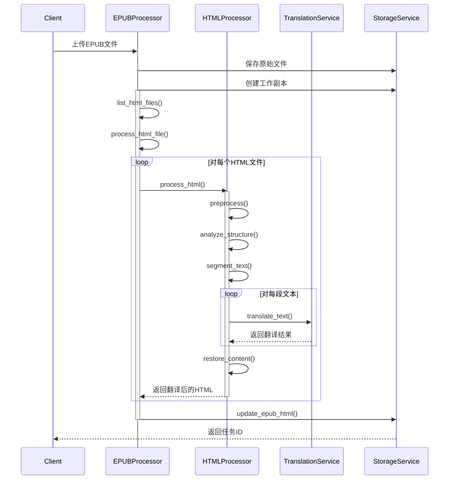
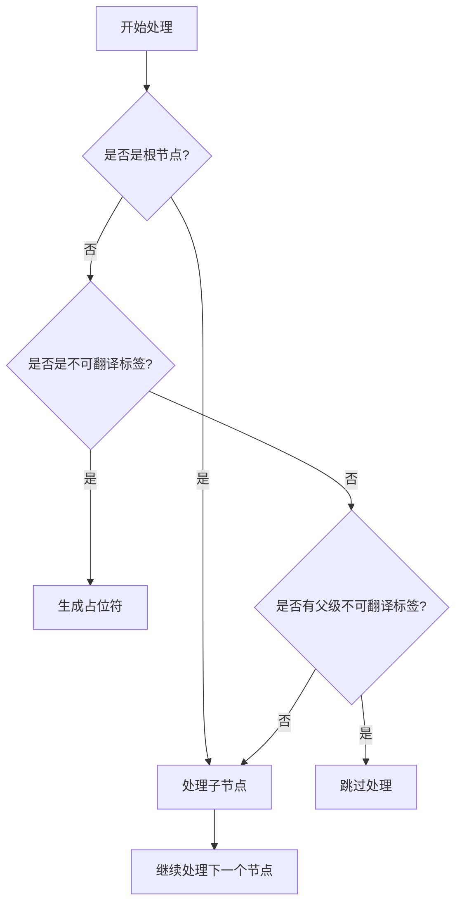

# EPUBox 最小可用版本架构设计

## 1. 系统概述

EPUBox 是一个基于网络服务的EPUB电子书翻译系统。最小可用版本专注于核心功能：在保持原书结构的同时翻译EPUB内容。

## 2. 系统架构

### 2.1 整体架构

```
┌─────────────────────────────────┐
│          Web API层             │
├─────────────────────────────────┤
│          核心服务层            │
│  ┌──────────┐    ┌──────────┐  │
│  │  EPUB    │    │  翻译    │  │
│  │  处理器  │    │  服务    │  │
│  └──────────┘    └──────────┘  │
├─────────────────────────────────┤
│          基础设施层            │
│  ┌──────────┐    ┌──────────┐  │
│  │  存储    │    │  日志    │  │
│  │  服务    │    │  服务    │  │
│  └──────────┘    └──────────┘  │
└─────────────────────────────────┘
```

### 2.2 核心组件

1. **Web API层**
   - 电子书上传和翻译接口
   - 翻译结果下载接口
   - 用户认证接口

2. **核心服务层**
   - EPUB处理器：处理EPUB文件的解析和重构
   - 翻译服务：对接翻译API（如OpenAI）
   - 认证服务：管理用户认证和授权

3. **基础设施层**
   - 存储服务：管理上传文件和翻译结果
   - 日志服务：基本系统日志

## 3. 基本工作流

```
┌──────────┐     ┌──────────┐     ┌──────────┐
│  上传    │ ──> │  翻译    │ ──> │  下载    │
└──────────┘     └──────────┘     └──────────┘
```

1. 用户上传EPUB文件
2. 系统处理翻译
3. 用户下载结果

## 4. 核心组件设计

### 4.1 处理流程



### 4.2 EPUB处理器

```python
class EPUBProcessor:
    """EPUB文件处理核心组件
    
    职责：
    1. 管理EPUB文件的读写
    2. 协调HTML内容的翻译流程
    3. 维护临时文件和工作目录
    """
    
    def __init__(self, html_processor: HTMLProcessor, temp_dir: str = None):
        self.html_processor = html_processor
        self.temp_dir = temp_dir or tempfile.mkdtemp()
    
    async def translate_epub(self, epub_path: str, source_lang: str, target_lang: str, output_path: str) -> str:
        """翻译EPUB文件的主入口
        
        Args:
            epub_path: 源EPUB文件路径
            source_lang: 源语言
            target_lang: 目标语言
            output_path: 输出文件路径
            
        Returns:
            输出文件路径
        """
        try:
            # 1. 提取内容
            contents = await self.extract_content(epub_path)
            
            # 2. 处理每个内容文件
            translated_contents = []
            for content in contents:
                translated_content = await self.html_processor.process_content(
                    content, source_lang, target_lang
                )
                translated_contents.append(translated_content)
            
            # 3. 保存翻译后的内容
            return await self.save_translated_content(
                epub_path, translated_contents, output_path
            )
        except Exception as e:
            logging.error(f"Failed to translate EPUB: {str(e)}")
            raise EPUBProcessorError(f"Translation failed: {str(e)}")
    
    async def extract_content(self, epub_path: str) -> List[Dict[str, Any]]:
        """提取EPUB文件中的可翻译内容"""
        pass
        
    async def save_translated_content(self, epub_path: str, translated_contents: List[Dict[str, Any]], output_path: str) -> str:
        """保存翻译后的内容到新的EPUB文件"""
        pass
```

### 4.3 HTML处理器

```python
class HTMLProcessor:
    """HTML内容处理组件
    
    职责：
    1. 处理从EPUB提取的HTML内容
    2. 确保内容分段不超过翻译服务的token限制
    3. 保持HTML结构和语义的完整性
    4. 处理长文档的分割和合并
    5. 保护和还原特殊HTML内容
    """
    
    def __init__(self, translation_service: TranslationService):
        self.translation_service = translation_service
        self.max_tokens = translation_service.get_token_limit()

    async def process_content(self, content: Dict[str, Any], source_lang: str, target_lang: str) -> Dict[str, Any]:
        """处理从EPUB提取的内容
        
        Args:
            content: EPUBProcessor提取的内容字典
                {
                    "id": str,           # 文件ID
                    "file_name": str,    # 文件名
                    "media_type": str,   # 媒体类型
                    "content": str       # HTML内容
                }
            source_lang: 源语言
            target_lang: 目标语言
            
        Returns:
            处理后的内容字典，保持相同的结构
        
        处理流程：
        1. 预处理：识别和保护不可翻译内容
        2. 分析结构：解析HTML树，识别可翻译节点
        3. 分段处理：按照语义和token限制分割内容
        4. 翻译处理：调用翻译服务
        5. 内容重组：合并翻译结果，还原HTML结构
        """
        pass

    async def preprocess(self, html_content: str) -> tuple[str, dict]:
        """HTML预处理
        
        - 识别并标记不需要翻译的内容：
          * 代码块 (<code>, <pre>)
          * 脚本和样式 (<script>, <style>)
          * 多媒体内容 (img, video等)
          * 数学公式 (<math>, LaTeX)
          * 特殊属性 (data-*, aria-*, role)
        
        - 生成规范的占位符：
          * 格式：[[TYPE_NAME_INDEX]]
          * 示例：[[CODE_BLOCK_1]], [[SCRIPT_1]]
        
        - 维护映射关系：
          * 记录原始内容和属性
          * 保存标签类型和索引
        """
        pass

    async def analyze_structure(self, html_content: str) -> dict:
        """分析HTML结构
        
        - 解析HTML树结构：
          * 识别标签层级关系
          * 标记可翻译节点
          * 确定语义边界
        
        - 结构信息记录：
          * 段落边界 (<p>, <div>, <section>)
          * 语义单元 (标题、列表项等)
          * 嵌套关系
        """
        pass

    async def segment_text(self, structure: dict) -> list:
        """文本分段处理
        
        分割策略：
        1. 语义完整性：
           - 优先在自然段落边界分割
           - 保持语义单元的完整性（标题、列表项等）
           - 不打断HTML标签结构
        
        2. 分割规则：
           - 首选边界：段落标签 (<p>, <div>, <section>)
           - 次选边界：句子结束（句号、问号、感叹号）
           - 最后选择：合适的分隔符（逗号、分号）
           - 禁止：词语中间分割
        
        3. Token控制：
           - 确保每段不超过最大token限制
           - 考虑翻译后文本可能的膨胀
           - 为特殊标记预留token空间
        
        4. 结构保护：
           - 保持原有HTML标签结构
           - 不引入新的HTML标签
           - 使用注释标记分割点
        
        返回：分段后的文本列表，每段都是完整的HTML片段
        """
        pass

    async def restore_content(self, translated_segments: list, mapping: dict) -> str:
        """还原处理后的内容
        
        - 合并翻译后的文本片段：
          * 按原有顺序重组
          * 移除临时注释标记
          * 确保HTML结构完整
        
        - 还原不可翻译内容：
          * 替换占位符
          * 还原原始属性
          * 保持标签完整性
        
        - 验证输出：
          * 检查HTML结构完整性
          * 验证所有占位符都已还原
          * 确保标签匹配
        """
        pass

    async def _handle_placeholders(self, html_content: str, mapping: dict) -> str:
        """处理占位符
        
        占位符设计：
        {
            "[[TAG_TYPE_1]]": {
                "type": "tag_name",          # 标签类型（pre, code, script等）
                "name": "tag_name",          # 原始标签名
                "content": "<tag>...</tag>", # 完整的原始HTML内容
                "attributes": {              # 所有属性的详细信息
                    "class": ["value"],
                    "data-x": "value",
                    "boolean-attr": None     # 布尔属性
                },
                "structure": {               # 标签的结构信息
                    "outer_html": "<tag>...</tag>",
                    "inner_html": "...",     # 内部HTML
                    "text_content": "..."    # 纯文本内容
                }
            }
        }
        
        处理流程：
        1. 预处理阶段：
           - 从外到内遍历HTML树
           - 遇到不可翻译标签时：
             * 生成唯一的占位符（[[TAG_TYPE_N]]）
             * 保存完整的标签信息（包括属性和内容）
             * 用占位符替换原标签
           - 遇到普通标签时：
             * 继续处理其子节点
             * 保留其结构和属性
        
        2. 翻译阶段：
           - 翻译包含占位符的文本
           - 占位符在翻译过程中保持不变
        
        3. 还原阶段：
           - 按占位符长度排序（避免部分替换）
           - 对每个占位符：
             * 优先使用保存的完整内容还原
             * 如果需要重建：使用保存的属性和结构信息
           - 验证还原结果的完整性
        """
        pass

### 4.3 HTML处理器详细设计

#### 4.3.1 Token 计算策略

1. **计算范围**
   - 只计算需要翻译的文本内容的 token 数量
   - 不计算 HTML 标签、属性等结构性内容
   - 使用 tiktoken 进行精确的 token 计算

2. **Token 限制**
   - 基础限制：每段最大 token 数（默认 1000）
   - 考虑翻译膨胀率：预留 1.5 倍空间
   - 实际限制 = 基础限制 / 1.5

#### 4.3.2 分段策略

1. **基本原则**
   - 保持语义单元完整性
   - 在自然段落边界处分段
   - 考虑 token 限制和膨胀率

2. **分段层次**
   - 一级分段：块级元素边界
   - 二级分段：当块级内容超过 token 限制时
   - 三级分段：按文本节点分割超长内容

3. **分段过程**
   ```mermaid
   flowchart TD
       A[开始] --> B{检查 token 数}
       B -- 超过限制 --> C{是否块级边界?}
       C -- 是 --> D[在边界处分段]
       C -- 否 --> E[尝试内容分割]
       B -- 未超过 --> F[继续累积]
       D --> G[下一个元素]
       E --> G
       F --> G
   ```

#### 4.3.3 技术实现细节

1. **占位符生成策略**

```python
class HTMLProcessor:
    def __init__(self):
        self._placeholder_counter = 1
        self.NON_TRANSLATABLE_TAGS = {'pre', 'code', 'script', 'style'}
        
    def generate_placeholder(self, tag_type: str) -> str:
        """生成唯一的占位符
        格式: [[TAG_TYPE_N]]，其中N是递增的计数器
        """
        placeholder = f"[[{tag_type.upper()}_{self._placeholder_counter}]]"
        self._placeholder_counter += 1
        return placeholder
```

2. **标签处理优先级**



3. **映射数据结构设计**

```python
@dataclass
class HTMLElement:
    """HTML元素的数据结构"""
    type: str                 # 标签类型
    name: str                 # 标签名
    content: str             # 原始内容
    attributes: Dict[str, Any] = field(default_factory=dict)  # 属性
    structure: Dict[str, str] = field(default_factory=dict)   # 结构信息
    
    def to_dict(self) -> Dict[str, Any]:
        """转换为字典格式用于存储"""
        return {
            "type": self.type,
            "name": self.name,
            "content": self.content,
            "attributes": self.attributes,
            "structure": self.structure
        }
```

4. **属性处理细节**

```python
class AttributeProcessor:
    """属性处理器"""
    
    @staticmethod
    def process_boolean_attr(value: Any) -> Optional[None]:
        """处理布尔属性（如async, defer）"""
        return None if value in (True, '') else value
    
    @staticmethod
    def process_class_attr(value: str) -> List[str]:
        """处理class属性"""
        return value.split() if isinstance(value, str) else value
    
    @staticmethod
    def process_style_attr(value: str) -> str:
        """处理style属性"""
        return value.strip()
    
    @staticmethod
    def process_data_attr(value: Any) -> Any:
        """处理data-*属性"""
        return json.dumps(value) if isinstance(value, (dict, list)) else str(value)
```

5. **还原策略**

```python
class RestoreStrategy:
    """内容还原策略"""
    
    @staticmethod
    def from_complete_content(mapping: Dict[str, Any]) -> str:
        """从完整内容还原"""
        return mapping["content"]
    
    @staticmethod
    def rebuild_from_parts(mapping: Dict[str, Any]) -> str:
        """从部分信息重建"""
        tag_name = mapping["name"]
        attrs = ' '.join(
            f'{k}="{v}"' if v is not None else k
            for k, v in mapping["attributes"].items()
        )
        inner_html = mapping["structure"]["inner_html"]
        return f"<{tag_name} {attrs}>{inner_html}</{tag_name}>"
```

6. **错误恢复机制**

```python
class ErrorRecovery:
    """错误恢复处理"""
    
    @staticmethod
    def validate_placeholder(placeholder: str) -> bool:
        """验证占位符格式"""
        return bool(re.match(r'\[\[([A-Z]+)_(\d+)\]\]', placeholder))
    
    @staticmethod
    def validate_mapping(mapping: Dict[str, Any]) -> bool:
        """验证映射数据完整性"""
        required_fields = {"type", "name", "content"}
        return all(field in mapping for field in required_fields)
    
    @staticmethod
    def validate_html_structure(html: str) -> bool:
        """验证HTML结构完整性"""
        soup = BeautifulSoup(html, 'html.parser')
        return bool(soup.find())
```

7. **性能优化策略**

a) **内存优化**：
   - 使用 `__slots__` 优化类内存使用
   - 及时清理不需要的映射数据
   - 使用生成器处理大型文档

```python
@dataclass
class HTMLElement:
    __slots__ = ['type', 'name', 'content', 'attributes', 'structure']
```

b) **时间优化**：
   - 使用集合进行O(1)查找
   - 预先编译正则表达式
   - 缓存常用的属性处理结果

```python
class HTMLProcessor:
    def __init__(self):
        self._placeholder_pattern = re.compile(r'\[\[([A-Z]+)_(\d+)\]\]')
        self._non_translatable_tags = frozenset(['pre', 'code', 'script', 'style'])
```

8. **安全处理**

```python
class SecurityHandler:
    """安全处理器"""
    
    @staticmethod
    def escape_html(text: str) -> str:
        """转义HTML特殊字符"""
        return html.escape(text)
    
    @staticmethod
    def sanitize_attributes(attrs: Dict[str, Any]) -> Dict[str, Any]:
        """清理属性值"""
        return {
            k: html.escape(str(v)) if isinstance(v, str) else v
            for k, v in attrs.items()
        }
    
    @staticmethod
    def validate_tag_name(name: str) -> bool:
        """验证标签名安全性"""
        return bool(re.match(r'^[a-zA-Z][a-zA-Z0-9]*$', name))
```

### 4.4 存储服务

```python
class StorageService:
    """存储服务"""
    
    def __init__(self, upload_dir: str, translation_dir: str):
        self.upload_dir = upload_dir
        self.translation_dir = translation_dir
        self._ensure_dirs()
    
    async def save_upload(self, file_data: bytes, filename: str) -> str:
        """
        保存上传的文件
        - 生成唯一文件ID
        - 保存到上传目录
        - 返回文件ID
        """
        file_id = await self._generate_file_id()
        file_path = os.path.join(self.upload_dir, file_id)
        
        async with aiofiles.open(file_path, 'wb') as f:
            await f.write(file_data)
        
        return file_id

    async def create_work_copy(self, file_id: str) -> str:
        """
        创建工作副本
        - 复制原始EPUB到翻译目录
        - 生成新的文件ID
        - 返回工作副本ID
        """
        work_copy_id = await self._generate_file_id()
        source_path = os.path.join(self.upload_dir, file_id)
        target_path = os.path.join(self.translation_dir, work_copy_id)
        
        await self._copy_file(source_path, target_path)
        return work_copy_id

    async def get_file(self, file_id: str) -> bytes:
        """
        获取文件内容
        - 支持获取原始文件或翻译后的文件
        - 文件不存在时抛出异常
        """
        # 先检查翻译目录
        file_path = os.path.join(self.translation_dir, file_id)
        if not os.path.exists(file_path):
            # 如果不存在，检查上传目录
            file_path = os.path.join(self.upload_dir, file_id)
            if not os.path.exists(file_path):
                raise FileNotFoundError(f"File {file_id} not found")
        
        async with aiofiles.open(file_path, 'rb') as f:
            return await f.read()

    async def read_epub_html(self, epub_id: str, html_path: str) -> str:
        """
        读取EPUB中的HTML文件内容
        - 使用epub库读取HTML内容
        - 处理编码问题
        """
        epub_path = os.path.join(self.translation_dir, epub_id)
        # 使用epub库读取指定的HTML文件
        pass

    async def update_epub_html(self, epub_id: str, html_path: str, content: str):
        """
        更新EPUB中的HTML文件
        - 使用epub库更新文件内容
        - 保持EPUB结构完整
        """
        epub_path = os.path.join(self.translation_dir, epub_id)
        # 使用epub库更新指定的HTML文件
        pass

    async def delete_file(self, file_id: str):
        """
        删除文件
        - 支持删除原始文件或翻译后的文件
        - 清理相关资源
        """
        # 检查并删除翻译目录中的文件
        translation_path = os.path.join(self.translation_dir, file_id)
        if os.path.exists(translation_path):
            os.remove(translation_path)
            return
        
        # 检查并删除上传目录中的文件
        upload_path = os.path.join(self.upload_dir, file_id)
        if os.path.exists(upload_path):
            os.remove(upload_path)

    async def _copy_file(self, source: str, target: str):
        """复制文件"""
        async with aiofiles.open(source, 'rb') as sf:
            async with aiofiles.open(target, 'wb') as tf:
                await tf.write(await sf.read())

    def _ensure_dirs(self):
        """确保必要的目录存在"""
        os.makedirs(self.upload_dir, exist_ok=True)
        os.makedirs(self.translation_dir, exist_ok=True)

    async def _generate_file_id(self) -> str:
        """生成唯一的文件ID"""
        return str(uuid.uuid4())
```

### 4.5 翻译服务

```python
class TranslationService:
    """翻译服务组件"""
    
    def __init__(self, api_key: str, concurrent_limit: int = 5):
        self.api_key = api_key
        self.semaphore = asyncio.Semaphore(concurrent_limit)
    
    async def batch_translate(self, texts: list[str], source_lang: str, target_lang: str) -> list[str]:
        """
        批量翻译文本
        - 使用信号量控制并发请求数
        - 处理API限流
        - 错误重试
        """
        tasks = []
        for text in texts:
            task = self.translate_text(text, source_lang, target_lang)
            tasks.append(task)
        
        return await asyncio.gather(*tasks)
    
    async def translate_text(self, text: str, source_lang: str, target_lang: str) -> str:
        """
        翻译单个文本
        - 调用翻译API
        - 处理错误和重试
        - 使用信号量控制并发
        """
        async with self.semaphore:
            try:
                # 调用翻译API
                return await self._call_translation_api(text, source_lang, target_lang)
            except Exception as e:
                # 处理API错误，进行重试
                return await self._handle_translation_error(e, text, source_lang, target_lang)
    
    async def _call_translation_api(self, text: str, source_lang: str, target_lang: str) -> str:
        """
        调用翻译API的具体实现
        - 处理API认证
        - 发送请求
        - 解析响应
        """
        pass
    
    async def _handle_translation_error(self, error: Exception, text: str, 
                                      source_lang: str, target_lang: str) -> str:
        """
        处理翻译错误
        - 实现重试逻辑
        - 记录错误信息
        - 返回备选结果
        """
        pass
```

### 4.6 认证服务

```python
class AuthService:
    """用户认证服务"""
    
    def __init__(self, secret_key: str):
        self.secret_key = secret_key
    
    async def authenticate(self, token: str) -> dict:
        """
        验证用户token
        - 验证JWT token
        - 检查token有效期
        - 返回用户信息
        """
        try:
            payload = jwt.decode(token, self.secret_key, algorithms=["HS256"])
            return payload
        except jwt.ExpiredSignatureError:
            raise AuthError("Token已过期")
        except jwt.InvalidTokenError:
            raise AuthError("无效的Token")
    
    async def create_token(self, user_id: str, username: str) -> str:
        """
        创建用户token
        - 生成JWT token
        - 设置过期时间
        - 包含必要的用户信息
        """
        payload = {
            "user_id": user_id,
            "username": username,
            "exp": datetime.utcnow() + timedelta(days=1)
        }
        return jwt.encode(payload, self.secret_key, algorithm="HS256")
    
    async def verify_permission(self, user_info: dict, required_permission: str) -> bool:
        """
        验证用户权限
        - 检查用户角色
        - 验证具体权限
        - 支持多级权限
        """
        pass
```

### 4.7 存储服务

存储服务的主要职责是：
1. 管理文件存储：
   - 处理用户上传的原始EPUB文件
   - 创建和管理翻译过程中的工作副本
   - 提供文件的持久化存储

2. 文件组织：
   - 为每个文件生成唯一ID
   - 维护清晰的目录结构
   - 区分原始文件和翻译文件

3. 文件操作：
   - 提供文件读写接口
   - 直接操作EPUB文件内容
   - 管理文件生命周期

4. 安全性：
   - 确保文件访问安全
   - 防止未授权访问
   - 保护原始文件不被修改

```python
class StorageService:
    """存储服务"""
    
    def __init__(self, upload_dir: str, translation_dir: str):
        self.upload_dir = upload_dir
        self.translation_dir = translation_dir
        self._ensure_dirs()
    
    async def save_upload(self, file_data: bytes, filename: str) -> str:
        """
        保存上传的文件
        - 生成唯一文件ID
        - 保存到上传目录
        - 返回文件ID
        """
        file_id = await self._generate_file_id()
        file_path = os.path.join(self.upload_dir, file_id)
        
        async with aiofiles.open(file_path, 'wb') as f:
            await f.write(file_data)
        
        return file_id

    async def create_work_copy(self, file_id: str) -> str:
        """
        创建工作副本
        - 复制原始EPUB到翻译目录
        - 生成新的文件ID
        - 返回工作副本ID
        """
        work_copy_id = await self._generate_file_id()
        source_path = os.path.join(self.upload_dir, file_id)
        target_path = os.path.join(self.translation_dir, work_copy_id)
        
        await self._copy_file(source_path, target_path)
        return work_copy_id

    async def get_file(self, file_id: str) -> bytes:
        """
        获取文件内容
        - 支持获取原始文件或翻译后的文件
        - 文件不存在时抛出异常
        """
        # 先检查翻译目录
        file_path = os.path.join(self.translation_dir, file_id)
        if not os.path.exists(file_path):
            # 如果不存在，检查上传目录
            file_path = os.path.join(self.upload_dir, file_id)
            if not os.path.exists(file_path):
                raise FileNotFoundError(f"File {file_id} not found")
        
        async with aiofiles.open(file_path, 'rb') as f:
            return await f.read()

    async def read_epub_html(self, epub_id: str, html_path: str) -> str:
        """
        读取EPUB中的HTML文件内容
        - 使用epub库读取HTML内容
        - 处理编码问题
        """
        epub_path = os.path.join(self.translation_dir, epub_id)
        # 使用epub库读取指定的HTML文件
        pass

    async def update_epub_html(self, epub_id: str, html_path: str, content: str):
        """
        更新EPUB中的HTML文件
        - 使用epub库更新文件内容
        - 保持EPUB结构完整
        """
        epub_path = os.path.join(self.translation_dir, epub_id)
        # 使用epub库更新指定的HTML文件
        pass

    async def delete_file(self, file_id: str):
        """
        删除文件
        - 支持删除原始文件或翻译后的文件
        - 清理相关资源
        """
        # 检查并删除翻译目录中的文件
        translation_path = os.path.join(self.translation_dir, file_id)
        if os.path.exists(translation_path):
            os.remove(translation_path)
            return
        
        # 检查并删除上传目录中的文件
        upload_path = os.path.join(self.upload_dir, file_id)
        if os.path.exists(upload_path):
            os.remove(upload_path)

    async def _copy_file(self, source: str, target: str):
        """复制文件"""
        async with aiofiles.open(source, 'rb') as sf:
            async with aiofiles.open(target, 'wb') as tf:
                await tf.write(await sf.read())

    def _ensure_dirs(self):
        """确保必要的目录存在"""
        os.makedirs(self.upload_dir, exist_ok=True)
        os.makedirs(self.translation_dir, exist_ok=True)

    async def _generate_file_id(self) -> str:
        """生成唯一的文件ID"""
        return str(uuid.uuid4())
```

## 5. API接口

### 5.1 基本接口

```
1. 认证相关
POST /auth/register - 用户注册
POST /auth/login - 用户登录
POST /auth/logout - 用户登出

2. 服务相关
POST /api/v1/books - 上传并翻译
GET /api/v1/books/{id}/download - 下载翻译结果
```

### 5.2 接口规范

#### 认证头格式
```
Authorization: Bearer <token>
```

#### 响应格式
```json
{
    "状态": "成功|失败",
    "数据": {
        // 具体数据
    },
    "错误": {
        "代码": "错误代码",
        "信息": "错误信息"
    }
}
```

## 6. 存储结构

```
/storage
  /uploads      - 原始文件
  /translations - 翻译结果
```

## 7. 配置项

```python
class Config:
    """基本配置"""
    # 认证配置
    JWT_SECRET_KEY = "your-secret-key"
    TOKEN_EXPIRES_IN = 60
    
    # 存储配置
    UPLOAD_FOLDER = "storage/uploads"
    TRANSLATION_FOLDER = "storage/translations"
    
    # 翻译配置
    TRANSLATION_API_KEY = "your-api-key"
    MAX_FILE_SIZE = 50 * 1024 * 1024  # 50MB
```

## 8. 可选功能

以下功能为可选实现，不影响最小可用版本：

1. 翻译进度管理
2. 任务状态追踪
3. 断点续译
4. 批量处理
