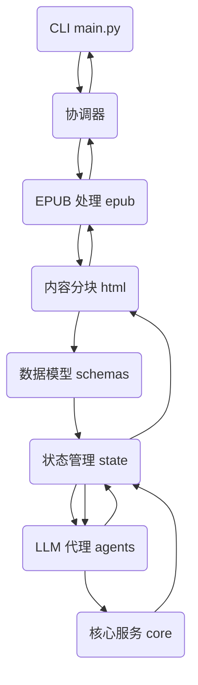

## EPUBox：智能 EPUB 翻译 CLI 工具架构设计

### 1. 项目概述

EPUBox 是一个基于命令行界面的 EPUB 电子书翻译工具，专注于利用大型语言模型（LLM）实现高效、可靠的翻译功能。该工具从源语言到目标语言的翻译过程中，强调 **token 消耗优化**、**断点续传支持**，以及 **模块化设计** 以便扩展。核心目标是提供一个轻量级、用户友好的 CLI 工具，帮助用户处理大中型 EPUB 文件，同时最小化 LLM API 调用成本。

**关键特性**：

  - **翻译引擎**：通过 Agno 框架集成 LLM（如 OpenAI、Claude 或开源模型），支持语义感知翻译。
  - **技术栈**：Typer (CLI)、ebooklib (EPUB 处理)、BeautifulSoup (HTML 操作，使用 lxml 解析器)、Agno (代理系统)、SQLAlchemy + SQLite (状态管理)、asyncio (异步处理)、tiktoken (token 估算)。
  - **优化焦点**：语义 chunking、上下文缓存、批量处理以节省 30-50% token；断点续传基于 chunk 级状态。
  - **MVP 范围**：聚焦基本翻译流程、CLI 命令、resume 功能。后续扩展多代理协作和质量验证。
  - **假设**：用户通过环境变量提供 LLM API 密钥；支持自动源语言检测（可选 langdetect）。

项目强调开源最佳实践，灵感来源于 epub-translator、bilingual\_book\_maker 等项目，结合 LLM 翻译优势（如 WMT24 研究显示 LLM 优于传统 MT）。

-----

### 2. 系统架构

#### 2.1 整体架构

新的架构设计将项目划分为三个主要部分，以清晰地分离关注点：

  - **根目录**：包含唯一的 CLI 启动脚本和项目配置文件。
  - **`core` 目录**：存放项目的核心配置和基础服务，如日志和环境变量。
  - **`engine` 目录**：所有业务逻辑的实现，包括数据处理、翻译流程和状态管理。

这种设计模式确保了启动、配置和业务逻辑的清晰分离。



#### 2.2 核心组件

1.  **CLI 接口 (`main.py`)**

      * **职责**：作为唯一的程序入口，使用 **Typer** 解析命令行参数，并根据用户命令调用 `engine/` 目录下的相应业务逻辑。
      * **设计**：
          * `@app.command("translate")`：翻译命令，负责调用 **`engine.orchestrator.EpubOrchestrator`** 并传入参数。
          * `@app.command("resume")`：续传命令，同样调用 `EpubOrchestrator` 并激活续传逻辑。
          * `@app.command("status")`：查询进度命令，调用 `engine.state_manager.StateManager` 报告当前翻译状态。

2.  **核心服务 (`core/`)**

      * **职责**：提供全项目通用的配置和基础工具。
      * **`core/config.py`**：使用 **Pydantic 的 `BaseSettings`** 定义配置模型，自动从环境变量或 `.env` 文件加载设置，确保配置的类型安全。
      * **`core/logger.py`**：使用 **Structlog** 配置结构化日志，方便在不同环境下（开发、生产）进行日志分析。

3.  **翻译引擎 (`engine/`)**

      * **职责**：实现所有翻译相关的核心功能。所有模块之间通过函数或类调用进行协作。
      * **`engine/orchestrator.py`**：核心流程协调器，协调解析、分块、翻译和构建的全过程。
      * **`engine/epub_handler.py`**：专注于 EPUB 文件的读取和打包。
      * **`engine/content_processor.py`**：处理 HTML 内容的分块和合并，不依赖 spaCy，而是基于 **BeautifulSoup** 遍历文本节点。
      * **`engine/llm_agent.py`**：封装了与 LLM API 的所有交互，并实现翻译请求、重试和缓存。
      * **`engine/state_manager.py`**：使用 **SQLAlchemy + SQLite** 管理翻译过程的持久化状态，支持断点续传。

4.  **数据模型 (`schemas/`)**

      * **职责**：使用 Pydantic 定义清晰的数据结构，用于在不同模块间传递数据，保证类型安全。
      * **`schemas/schemas.py`**：所有数据模型（如 `Chunk`、`BookMetadata`）都将集中在这个单一文件中。

-----

### 3. 核心工作流程

1.  **初始化（CLI 命令）**

      * 解析命令行参数，加载配置（.env 或 YAML）。
      * 计算 EPUB 文件哈希以唯一标识。
      * 初始化或加载 SQLite 状态。

2.  **解析**

      * 使用 `ebooklib` 流式读取 EPUB，提取 HTML 章节。
      * 将元数据和章节列表存储到状态。

3.  **分块**

      * 对于每个 HTML 文件，使用 `BeautifulSoup` 提取可翻译文本节点（例如 `<p>`、`<span>`，排除代码/链接）。
      * 将这些文本节点组合成 chunk，分配 ID，并保存原始 chunk 到状态。

4.  **翻译**

      * 从状态过滤 pending chunk。
      * 异步批量发送到 Agno 代理：翻译、更新状态（结果和 token）。
      * **优化**：先查缓存；如果上下文限额下批量。
      * 定期检查点或中断时（通过信号处理程序）。

5.  **合并与构建**

      * 使用 `BeautifulSoup` 重建带有翻译 chunk 的 HTML。
      * 使用 `ebooklib` 构建新 EPUB。
      * 如果不完整，生成部分输出。

6.  **续传与错误处理**

      * **续传**：验证哈希，从 pending 继续。
      * **错误**：LLM 调用重试（3 次，指数退避），日志失败，允许部分输出。

-----

### 4. 目录结构

这是最终的、完整的设计目录结构，遵循 Python 的最佳实践。

```
.
├── main.py                    # Typer CLI 入口
├── pyproject.toml             # 项目元数据与依赖
├── requirements.txt           # 依赖列表
├── .env.example               # 环境变量配置示例
├── core/
│   ├── __init__.py
│   ├── config.py              # 项目配置
│   └── logger.py              # Structlog 日志配置
├── engine/
│   ├── __init__.py            # 将engine目录声明为包
│   ├── orchestrator.py        # 流程协调
│   ├── state.py               # 状态管理
│   ├── agents/
│   │   ├── __init__.py
│   │   ├── proofer.py         # 翻译后校验
│   │   ├── translator.py      # LLM 翻译代理
│   │   └── workflow.py        # 代理工作流编排
│   ├── epub/
│   │   ├── __init__.py
│   │   ├── builder.py         # EPUB 文件构建
│   │   └── parser.py          # EPUB 文件解析
│   ├── html/
│   │   ├── __init__.py
│   │   ├── builder.py         # HTML 重建
│   │   ├── chunker.py         # HTML 内容分块
│   │   ├── merger.py          # HTML 内容合并
│   │   └── parser.py          # HTML 内容解析
│   └── schemas/
│       ├── __init__.py
│       └── schemas.py         # 所有Pydantic数据模型
└── tests/
    └── engine/
        ├── test_orchestrator.py
        └── ...
```

-----

### 5. 扩展性设计与 MVP 分阶段

  - **MVP 实现**：聚焦单一代理翻译、规则分块、SQLite 续传。目标：小型 EPUB 端到端翻译。
  - **后续扩展**：添加 OptimizerAgent（动态批量）、质量检查（BLEU 分数）、Redis 缓存、多代理协作、Web 接口。
  - **扩展性**：抽象接口（例如 `BaseTranslator` 用于新 LLM）、Agno 插件钩子用于自定义代理。
  - **配置**：YAML 文件用于默认值（chunk\_size、重试次数、提示模板）。

-----

### 6. 性能与可靠性考虑

  - **性能**：异步 LLM 调用（并发限 5），流式处理大 EPUB（内存 \<500MB 用于 1MB 文件）。基准：模拟测试。
  - **Token 节省**：通过缓存/批量，目标减少 40%；预估总成本，超出预算暂停并通知。
  - **可靠性**：基于哈希的完整性检查、SQLite 事务写入、中断时优雅关闭。
  - **测试**：Pytest 用于单元（分块）、集成（LLM mock）、端到端（样本 EPUB）。
  - **依赖管理**：`requirements.txt` 中固定版本；
